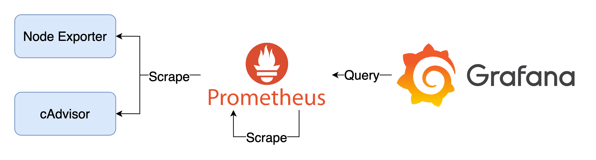

# Exporter



## Quick Start

1. 啟動所有服務

    ```bash
    docker-compose up -d
    ```

2. 檢視服務
   1. Prometheus: `http://localhost:9090`
   2. Node Exporter: `http://localhost:9100`
   3. CAdvisor: `http://localhost:8080`
   4. Grafana: `http://localhost:3000`，登入帳號密碼為 `admin/admin`
3. 關閉所有服務

    ```bash
    docker-compose down
    ```

## Goals

1. 建立 Prometheus，爬取 Node Exporter 與 cAdvisor 的 Metrics
2. 建立 Node Exporter，取得 Host 的 Metrics
3. 建立 cAdvisor，取得 Container 的 Metrics
4. 建立 Grafana，透過 Provisioning 的方式建立 Prometheus Data Source 與 Dashboard，Dashboard 包含：
   1. CAdvisor exporter：視覺化呈現 cAdvisor 的 Metrics 於 Dashboard
   2. Node Exporter Full：視覺化呈現 Node Exporter 的 Metrics 於 Dashboard

## Grafana Dashboard

1. [Cadvisor exporter](https://grafana.com/grafana/dashboards/14282-cadvisor-exporter/)
2. [Node Exporter Full](https://grafana.com/grafana/dashboards/1860-node-exporter-full/)
