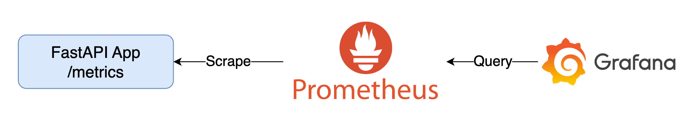

# Monitoring Best Practices



## Quick Start

1. 啟動所有服務

    ```bash
    docker-compose up -d
    ```

2. 檢視服務
   1. Prometheus: [http://localhost:9090](http://localhost:9090)
   2. FastAPI App: [http://localhost:8000](http://localhost:8000)
      1. 可瀏覽 [http://localhost:8000/metrics](http://localhost:8000/metrics) 確認 Metrics 資料
      2. 對 FastAPI App 發送 HTTP Request，即可看到 Dashboard 的變化
         1. 透過瀏覽器發送 Request
            1. [http://localhost:8000](http://localhost:8000)
            2. [http://localhost:8000/io_task](http://localhost:8000/io_task)
            3. [http://localhost:8000/cpu_task](http://localhost:8000/cpu_task)
            4. [http://localhost:8000/random_sleep](http://localhost:8000/random_sleep)
            5. [http://localhost:8000/random_status](http://localhost:8000/random_status)
         2. 或是使用 [k6](https://k6.io/) 發送 Request

            ```bash
            k6 run --vus 1 --duration 300s k6-script.js
            ```

   3. Grafana: [http://localhost:3000](http://localhost:3000)，登入帳號密碼為 `admin/admin`
3. 關閉所有服務

    ```bash
    docker-compose down
    ```

## Goals

1. 根據 Prometheus 收集到的 FastAPI App Metrics，在 Grafana 中建立一個應用 The RED Method 的 Dashboard

## Tasks

<details><summary>Task 1: 根據 Prometheus 收集到的 FastAPI App Metrics，在 Grafana 中建立一個應用 The RED Method 的 Dashboard</summary>

1. (Request) Rate 每秒請求數：可以使用 `fastapi_requests_total` 這個指標，它會紀錄所有請求的數量
2. (Request) Errors 每秒失敗請求數：可以使用 `fastapi_responses_total{status_code!~"2.*|3.*"}` 取得非 2xx 與 3xx 的請求數量
3. (Request) Duration 請求耗時分布：可以使用 `fastapi_requests_duration_seconds_bucket` 這個指標，它會紀錄所有請求的耗時分布，包含成功與失敗的請求
4. 可以匯入 `etc/grafana/dashboards/fastapi-red.json` 這個 Dashboard，觀摩如何應用 RED Method

</details>
