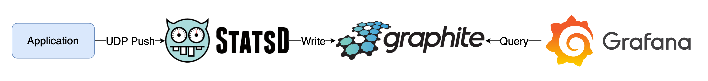
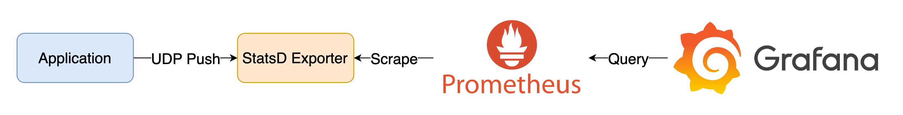

# StatsD

## StatsD + Graphite



### Quick Start

1. 啟動所有服務

    ```bash
    docker-compose up -d
    ```

2. 檢視服務
   1. FlaskAPI: [http://localhost:8000](http://localhost:8000)
      1. 透過瀏覽器發送 Request
         1. [http://localhost:8000](http://localhost:8000)
         2. [http://localhost:8000/io_task](http://localhost:8000/io_task)
         3. [http://localhost:8000/cpu_task](http://localhost:8000/cpu_task)
         4. [http://localhost:8000/random_sleep](http://localhost:8000/random_sleep)
         5. [http://localhost:8000/random_status](http://localhost:8000/random_status)
      2. 或是使用 [k6](https://k6.io/) 發送 Request

            ```bash
            k6 run --vus 1 --duration 300s k6-script.js
            ```

   2. Graphite Web UI: [http://localhost](http://localhost)
      1. 確認指標收集結果，展開左側選單 Metrics > stats > timers > flask > request_durations_seconds > count，若未出現 `flask` 選單，請等待一段時間後重新整理頁面
      2. 或是直接進入 [http://localhost/render?from=-10mins&until=now&target=stats.timers.flask.request_duration_seconds.count](http://localhost/render?from=-10mins&until=now&target=stats.timers.flask.request_duration_seconds.count)
   3. Grafana: [http://localhost:3000](http://localhost:3000)，登入帳號密碼為 `admin/admin`
      1. 進入 Explore 選單，Data Source 選擇 Graph，`Series` 依序選擇 `stats`、`timers`、`flask`、`request_duration_seconds`、`count`，再執行 Query 即可看到指標資料
3. 關閉所有服務

    ```bash
    docker-compose down
    ```

### Goals

1. 使用 All in One Image: graphiteapp/docker-graphite-statsd 將 StatsD 與 Graphite 一起啟動
2. 使用 Graphite web UI 確認指標收集結果
3. Flask API 透過標準的 StatsD Library [statsd](https://github.com/jsocol/pystatsd) 產生 Metrics

## StatsD Exporter + Prometheus



### Quick Start

1. 啟動所有服務

    ```bash
    docker-compose -f docker-compose.exporter.yaml up -d
    ```
2. 檢視服務
   1. FlaskAPI: [http://localhost:8000](http://localhost:8000)
      1. 透過瀏覽器發送 Request
         1. [http://localhost:8000](http://localhost:8000)
         2. [http://localhost:8000/io_task](http://localhost:8000/io_task)
         3. [http://localhost:8000/cpu_task](http://localhost:8000/cpu_task)
         4. [http://localhost:8000/random_sleep](http://localhost:8000/random_sleep)
         5. [http://localhost:8000/random_status](http://localhost:8000/random_status)
      2. 或是使用 [k6](https://k6.io/) 發送 Request

            ```bash
            k6 run --vus 1 --duration 300s k6-script.js
            ```

   2. StatsD Exporter: [http://localhost:9102/metrics](http://localhost:9102/metrics)
      1. 檢視 StatsD Exporter 收集轉換成 Prometheus Metrics 的 Metrics
   3. Prometheus: [http://localhost:9090](http://localhost:9090)
      1. 檢視是否有 `flask` 開頭的 Metrics
   4. Grafana: [http://localhost:3000](http://localhost:3000)，登入帳號密碼為 `admin/admin`
      1. 點擊左上 Menu > Dashboards > Flask Monitoring，即可看到透過 Provisioning 建立的 Dashboard
3. 關閉所有服務

    ```bash
    docker-compose -f docker-compose.exporter.yaml down
    ```

### Goals

1. 使用 StatsD Exporter 將 StatsD 資料轉換成 Prometheus Metrics
2. 使用 Prometheus 收集 Metrics
3. 使用 Grafana 查詢 Prometheus Metrics
4. Flask API 透過 DataDog 重新實作的 [DogStatsD](https://docs.datadoghq.com/developers/dogstatsd/) 的 Library [DataDog](https://github.com/DataDog/datadogpy) 產生 Metrics

## 參考資料

1. [docker-graphite-statsd](https://github.com/graphite-project/docker-graphite-statsd)
2. [Flask Monitoring](https://github.com/blueswen/flask-monitoring#flask-monitoring)
