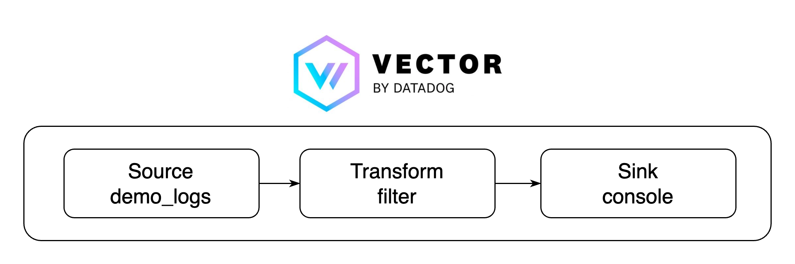
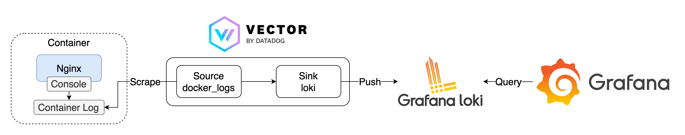

# Vector

## Basic



### Quick Start

1. 啟動所有服務

    ```bash
    docker-compose -f docker-compose.loki.yaml up -d
    ```

2. 檢視服務
   1. Nginx: [http://localhost:8080](http://localhost:8080)
      1. 瀏覽 Nginx 時會生成 Access Log
   2. Grafana: [http://localhost:3000](http://localhost:3000)，登入帳號密碼為 `admin/admin`
      1. 點擊左上 Menu > Explore，左上 Data Source 選擇 `Loki`，在 Label Filter 中 Label 選擇 `app`，Value 選擇 `nginx`，即可看到 nginx Container 的 Log
      2. 若要生成更多 Log 也可以使用 [k6](https://k6.io/) 發送更多 Request

            ```bash
            k6 run --vus 1 --duration 300s k6-script.js
            ```

3. 關閉所有服務

    ```bash
    docker-compose down
    ```

### Goals

1. 建立 Vector
   1. 使用 [Demo Logs](https://vector.dev/docs/reference/configuration/sources/demo_logs/) 作為 source，生成假的 JSON 格式 Log
   2. 使用 [Filter](https://vector.dev/docs/reference/configuration/transforms/filter/) 作為 transform，只保留 `method` 為 `GET` 的資料
   3. 使用 [Console](https://vector.dev/docs/reference/configuration/sinks/console/) 作為 sink，將資料輸出至 Console

## Container Log with Loki



### Quick Start

1. 啟動所有服務

    ```bash
    docker-compose -f docker-compose.loki.yaml up -d
    ```

2. 檢視服務
   1. Nginx: [http://localhost:8080](http://localhost:8080)
      1. 瀏覽 Nginx 時會生成 Access Log
   2. Grafana: [http://localhost:3000](http://localhost:3000)，登入帳號密碼為 `admin/admin`
      1. 點擊左上 Menu > Explore，左上 Data Source 選擇 `Loki`，在 Label Filter 中 Label 選擇 `container_name`，Value 選擇 `nginx`，即可看到 nginx Container 的 Log
      2. 若要生成更多 Log 也可以使用 [k6](https://k6.io/) 發送更多 Request

            ```bash
            k6 run --vus 1 --duration 300s k6-script.js
            ```

3. 關閉所有服務

    ```bash
    docker-compose down
    ```

### Goals

1. 建立 Vector
   1. 使用 [Docker Logs](https://vector.dev/docs/reference/configuration/sources/docker_logs/) 作為 source，收集 Docker Container 的 Log，只篩選含有 `logger=vector` Label 的 Container
   2. 使用 [Loki](https://vector.dev/docs/reference/configuration/sinks/loki/) 作為 sink，將資料輸出至 Loki，移除不使用的 Field：`container_created_at`、`container_id`、`labels`，並使用 `container_name` 作為 Loki 的 Label
2. 建立 Loki，負責收取 Vector 傳送的 Log
3. 建立 Grafana，讀取 Loki 的資料
4. 建立 Nginx，產生 Log

## 參考資料

1. [Centralized logs with Loki and Vector](https://ilhicas.com/2023/01/29/Using-vector-to-centralize-logs-in-loki.html)
