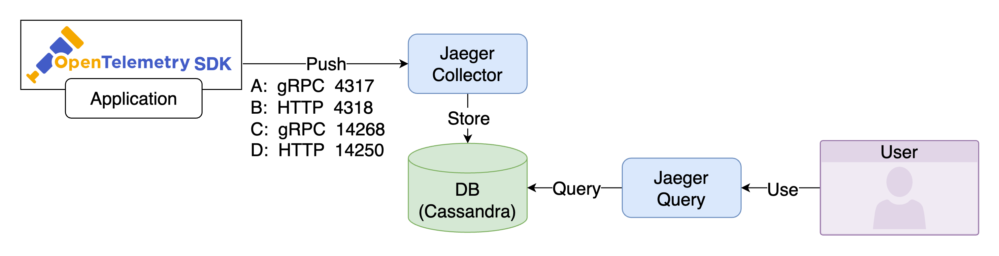

# Jaeger



在範例中使用了四個方式來發送 Trace Data：

A. 透過 gRPC 發送 OTLP Trace Data 至 Jaeger Collector 的 4317 Port
B. 透過 HTTP 發送 OTLP Trace Data 至 Jaeger Collector 的 4318 Port
C. 透過 gRPC 發送 jaeger.thrift Trace Data 至 Jaeger Collector 的 14268 Port
D. 透過 HTTP 發送 model.proto Trace Data 至 Jaeger Collector 的 14250 Port

Jaeger Collector 會將 Trace Data 寫入 DB，Jaeger Query 則是從 DB 讀取 Trace Data 並提供 UI 查看。

## Quick Start

1. 啟動所有服務

    ```bash
    docker-compose up -d
    ```

2. 檢視服務
   1. 因 Cassandra 需要一些時間初始化，確認 Jaeger Collector 與 Jaeger Query 已啟動後，再繼續下一步

        ```bash
        docker-compose ps
        ```

   2. FastAPI App
      1. app-a: [http://localhost:8000](http://localhost:8000)
      2. app-b: [http://localhost:8001](http://localhost:8001)
      3. app-c: [http://localhost:8002](http://localhost:8002)
      4. app-d: [http://localhost:8003](http://localhost:8003)
   3. Jaeger UI: [http://localhost:16686](http://localhost:16686)
      1. 選擇 Service 後點選 Find Traces，即可看到 Trace Data
      2. 透過瀏覽器對 application 的 `/chain` 發送 Request，可以在 Trace 資訊中看到 `app-a`、`app-b`、`app-c` 互相呼叫的順序
         1. app-a: [http://localhost:8000/chain](http://localhost:8000/chain)
         2. app-b: [http://localhost:8001/chain](http://localhost:8001/chain)
         3. app-c: [http://localhost:8002/chain](http://localhost:8002/chain)
         4. app-d: [http://localhost:8003/chain](http://localhost:8003/chain)
      3. 或是使用 [k6](https://k6.io/) 發送 Request

            ```bash
            k6 run --vus 1 --duration 300s k6-script.js
            ```
   
   4. Grafana: [http://localhost:3000](http://localhost:3000)，登入帳號密碼為 `admin/admin`
      1. 點擊左上 Menu > Explore，左上 Data Source 選擇 `Jaeger`，可以查詢 Jaeger 的 Trace Data

3. 關閉所有服務

    ```bash
    docker-compose down
    ```

## Goals

1. 建立 Jaeger Components
   1. Jaeger Collector: 接收 Application 發送的 Trace Data
   2. Jaeger Query: 提供 UI 查看 Trace Data
   3. Cassandra: 儲存 Trace Data
   4. Cassandra Schema: 初始化 Cassandra DB
2. FastAPI 透過 OpenTelemetry 發送 Trace Data 至 Jaeger Collector
   1. app-a: 透過 gRPC 發送 OTLP Trace Data 至 Jaeger Collector 的 4317 Port
   2. app-b: 透過 HTTP 發送 OTLP Trace Data 至 Jaeger Collector 的 4318 Port
   3. app-c: 透過 gRPC 發送 jaeger.thrift Trace Data 至 Jaeger Collector 的 14268 Port
   4. app-d: 透過 HTTP 發送 model.proto Trace Data 至 Jaeger Collector 的 14250 Port
3. 建立 Grafana 讀取 Jaeger Data Source 查看 Trace Data

## 參考資料

1. [docker compose example](https://github.com/jaegertracing/jaeger/blob/main/docker-compose/jaeger-docker-compose.yml)
2. [FastAPI Tracing with Jaeger through OpenTelemetry](https://github.com/blueswen/fastapi-jaeger)
