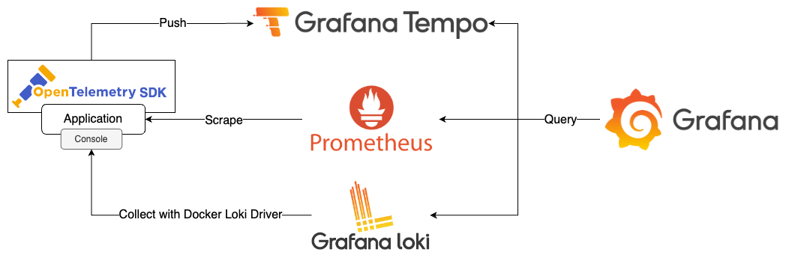

# Correlation



## Quick Start

1. 安裝 [Loki Docker Driver](https://grafana.com/docs/loki/latest/clients/docker-driver/)

    ```bash
    docker plugin install grafana/loki-docker-driver:latest --alias loki --grant-all-permissions
    ```
    
2. 啟動所有服務

    ```bash
    docker-compose up -d
    ```

3. 檢視服務
   1. FastAPI App
      1. app-a: [http://localhost:8000](http://localhost:8000)
      2. app-b: [http://localhost:8001](http://localhost:8001)
   2. Spring Boot App
      1. app-c: [http://localhost:8002](http://localhost:8002)
   3. Prometheus: [http://localhost:9090](http://localhost:9090)
   4. Grafana: [http://localhost:3000](http://localhost:3000)，登入帳號密碼為 `admin/admin`
      1. 使用 [k6](https://k6.io/) 發送 Request

            ```bash
            k6 run --vus 1 --duration 300s k6-script.js
            ```

      2. 使用 Explore 檢視 Tempo、Loki、Prometheus 資料
4. 關閉所有服務

    ```bash
    docker-compose down
    ```

## Goals

1. 建立 FastAPI App（app-a、app-b）
   1. 透過 OpenTelemetry Manual Instrumentation 產生與收集 Traces，並發送至 Tempo
   2. 透過 OpenTelemetry Manual Instrumentation，將 Trace id 加入 Log 中，輸出於 console
   3. 透過 Prometheus Client 產生 OpenMetrics 格式的 Metrics，揭露於 `/metrics` endpoint
2. 建立 Spring Boot App（app-c）
   1. 透過 OpenTelemetry Automatic Instrumentation 產生與收集 Traces，並發送至 Tempo
   2. 透過 OpenTelemetry Automatic Instrumentation 與 Logback，將 Trace id 加入 Log 中，輸出於 console
   3. 透過 Spring Boot Actuator 與 Micrometer，產生 OpenMetrics 格式的 Metrics，揭露於 `/actuator/prometheus` endpoint
3. 建立 Tempo，接收 Traces 資料
4. 建立 Loki，搭配 Loki Docker Driver 收集 Container Log
5. 建立 Prometheus，啟用 Exemplar 功能，收集 app-a、app-b、app-c 的 Metrics
6. 建立 Grafana，查詢 Tempo、Loki、Prometheus 資料
7. Correlation
   1. Metrics & Logs
      1. 於 Explore 開啟兩個 Panel，並透過時間同步功能，鎖定左右兩側 Panel 的時間
         1. 右側 Panel 選擇 Prometheus Data Source，搜尋 `sum(rate(fastapi_requests_total{app_name="app-a"}[3m])*60) by(app_name, path)`，計算出每分鐘的 Request 數量
         2. 左側 Panel 選擇 Loki Data Source，Label 設定為 `container_name=app-a`，查詢出 app-a 的 Log
   2. Metrics to Traces
      1. 於 Explore 選擇 Prometheus Data Source，搜尋 `histogram_quantile(.99,sum(rate(fastapi_requests_duration_seconds_bucket{app_name="app-a", path!="/metrics"}[1m])) by(path, le))`，並展開 Options 選單啟用 Exemplars
      2. Hover 在圖表上的某個點，可以看到該點的 Trace id，點擊 Query with Tempo 可以查詢該 Trace 的資料
   3. Logs to Traces
      1. 於 Explore 選擇 Loki Data Source，Label 設定為 `container_name=app-a`，查詢出 app-a 的 Log，點擊某筆 Log 展開 Log 明細，可以看到該筆 Log 的 Trace id，點擊 Tempo 可以查詢該 Trace 的資料
   4. Traces to Logs
      1. 於 Explore 選擇 Tempo Data Source，使用 TraceQL 語法查詢 `{resource.service.name="app-a" && name="GET /chain"}`
      2. 開啟任一筆 Trace 資料，點擊某一筆 Span 右側的連結 ICON 開啟選單，選擇 `Related logs`，可以查詢該 Span 對應的 Service 與 Trace id 的 Log
   5. Traces to Metrics
      1. 於 Explore 選擇 Tempo Data Source，使用 TraceQL 語法查詢 `{resource.service.name="app-a" && name="GET /chain"}`
      2. 開啟任一筆 Trace 資料，點擊某一筆 Span 右側的連結 ICON 開啟選單，選擇 `Request Duration PR95` 或 `Request Rate Per Min`，可以查詢使用該 Span Attributes 作為查詢條件的 Metrics

## 參考資料

1. [Intro to exemplars, which enable Grafana Tempo’s distributed tracing at massive scale](https://grafana.com/blog/2021/03/31/intro-to-exemplars-which-enable-grafana-tempos-distributed-tracing-at-massive-scale/)
2. [FastAPI with Observability](https://github.com/blueswen/fastapi-observability)
3. [Spring Boot with Observability](https://github.com/blueswen/spring-boot-observability)
