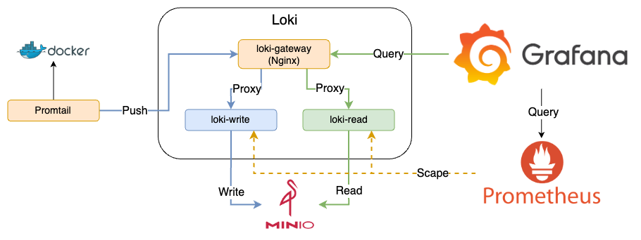
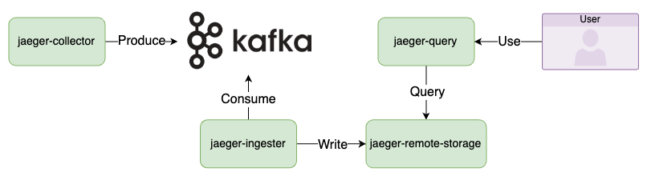

# Scalability

## Loki Scalable Monolithic


藍色線為 Write，綠色線為 Read

### Quick Start

1. 啟動所有服務

    ```bash
    docker-compose up -d
    ```

2. 檢視服務
   1. FastAPI App: [http://localhost:8000](http://localhost:8000)
   2. Nginx: [http://localhost:8080](http://localhost:8080)
   3. Prometheus: [http://localhost:9090](http://localhost:9090)
   4. Loki:
      1. loki-read: [http://localhost:3101/metrics](http://localhost:3101/metrics)
      2. loki-write: [http://localhost:3102/metrics](http://localhost:3102/metrics)
   5. MinIO: Web UI Console [http://localhost:9001](http://localhost:9001)，登入帳號密碼為 `loki/supersecret`
   6. Grafana: [http://localhost:3000](http://localhost:3000)，登入帳號密碼為 `admin/admin`
      1. Log
         1. 使用 [k6](https://k6.io/) 發送 Request

               ```bash
               k6 run --vus 1 --duration 300s k6-script.js
               ```

         2. 使用 Explore 檢視 Loki 資料
      2. Loki Metrics
         1. 點擊左上 Menu > Dashboards > Loki Metrics，即可看到透過 Provisioning 建立的 Dashboard
3. 關閉所有服務

    ```bash
    docker-compose down
    ```

### Goals

1. 建立 FastAPI App 與 Nginx，模擬服務產生 Log
2. 建立 Promtail，並 Mount Docker Socket 至 Promtail Container，讓 Promtail 可以讀取 Label 為 `logging=promtail` 的 Container 的 Log
3. 建立 Loki
   1. loki-gateway: Nginx proxy，根據 URL 將 Request 轉發至 loki-read 或 loki-write
   2. loki-read: 負責查詢 Log，從 MinIO 讀取 Log
   3. loki-write: 負責接收 Promtail 傳送的 Log，並寫入到 MinIO
4. 建立 Minio，作為 Loki 的 Object Storage
5. 建立 Prometheus，爬取 loki-read 與 loki-write 的 Metrics
6. 建立 Grafana，讀取 Loki 的資料

## Jaeger with Kafka



### Quick Start

1. 啟動所有服務

    ```bash
    docker-compose -f docker-compose.jaeger.yaml up -d
    ```

2. 檢視服務
   1. 因 Kafka 需要一些時間初始化，確認 Kafka 已啟動後，再繼續下一步

        ```bash
        docker-compose ps
        ```

   2. Redpanda Console: [http://localhost:8080](http://localhost:8080)
      1. 選擇 Topics，再點選 jaeger-spans，即可看到 Jaeger Collector 發送的 encode 過後的 Trace Data
   3. Jaeger UI: [http://localhost:16686](http://localhost:16686)
      1. 選擇 Service 後點選 Find Traces，即可看到 [xk6-client-tracing](https://github.com/grafana/xk6-client-tracing/tree/main) 自動發送的 Trace Data

3. 關閉所有服務

    ```bash
    docker-compose -f docker-compose.jaeger.yaml down
    ```

### Goals

1. 建立 Jaeger Components
   1. Jaeger Collector: 接收 Application 發送的 Trace Data
   2. Jaeger Query: 對 Jaeger Remote Storage 發送查詢，提供 UI 查看 Trace Data
   3. Jaeger Remote Storage: 負責儲存 Trace Data
   4. Jaeger Ingester: 從 Kafka 讀取 Trace Data，並將 Trace Data 寫入到 Storage Backend
2. 建立 Kafka Components
   1. Kafka: 接收 Jaeger Collector 發送的 Trace Data，供 Jaeger Ingester 讀取
   2. Zookeeper: Kafka 的依賴
3. 建立 [Redpanda Console](https://github.com/redpanda-data/console) 檢視 Kafka 資訊
4. 建立 [xk6-client-tracing](https://github.com/grafana/xk6-client-tracing/tree/main)，Container 啟動後會自動產生 Traces 資料並發送至 Jaeger，模擬真實環境的 Traces 資料

## 參考資料

1. [Loki SSD Docker Example](https://github.com/grafana/loki/tree/main/examples/getting-started)
2. [Loki2.0 Global Metrics](https://grafana.com/grafana/dashboards/13407-loki2-0-global-metrics/)
3. [Sample configuration with Kafka](https://github.com/jaegertracing/jaeger/tree/main/docker-compose/kafka)
