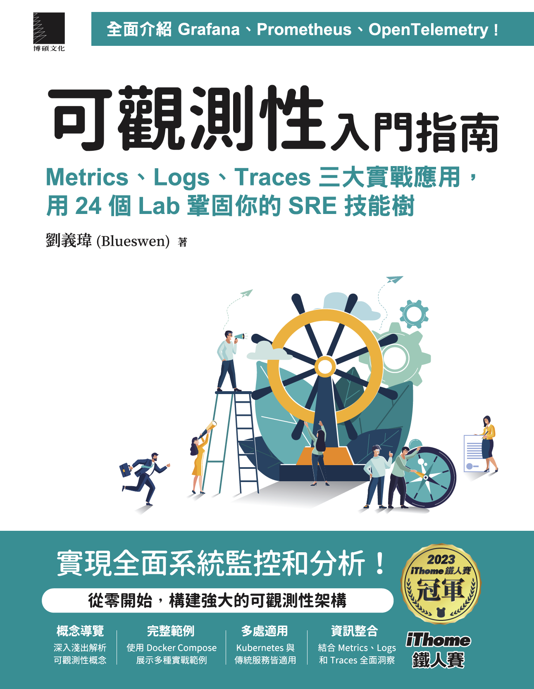

# 可觀測性入門指南：Logs、Metrics、Traces 三大實戰應用，用 24 個 Lab 鞏固你的 SRE 技能樹

此 Project 為 [可觀測性入門指南：Logs、Metrics、Traces 三大實戰應用，用 24 個 Lab 鞏固你的 SRE 技能樹](https://www.tenlong.com.tw/products/9786263339538) 與 iThome 鐵人賽 2023 [「時光之鏡：透視過去、現在與未來的 Observability」](https://ithelp.ithome.com.tw/users/20162175/ironman/6445) 的範例程式碼 Repo。

購買連結：

1. [天瓏網路書店](https://www.tenlong.com.tw/products/9786263339538)
2. [博客來](https://www.books.com.tw/products/0010999165)

## 常見問題排除

1. 已安裝 Docker Loki Driver，但使用時出現 `Error response from daemon: error looking up logging plugin loki: plugin loki found but disabled` 錯誤訊息
   1. 重新啟用 Loki Driver，執行指令 `docker plugin enable loki`
